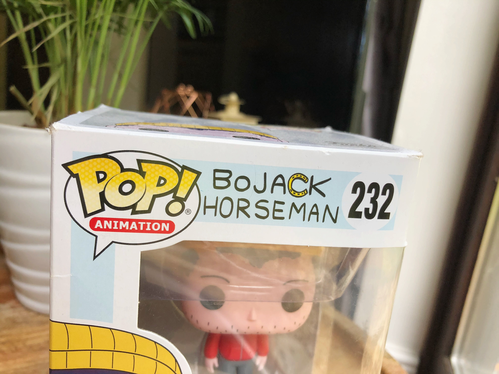

The titular love or hate character of the popular Netflix show recently hung up his hooves after the series concluded with a poignant chat on a roof, but Bojack Horseman will likely stick around in fan's minds for years to come. Not only is the washed-up actor a relatable example of disappointment and perseverance, the iconic typographical style of the title (his name) is immediately recognisable and uniquely stylistic.

I caught a glimpse of the title again on this collectible from the show and was reminded of how well the typographic design choices compliment the show and subtly communicate the nature of the character. The handwritten style and imperfect appearance of the lettering alludes to a personal insight, unhinged behaviour, and perhaps a flippant attitude towards living a dignified life. 

The all-caps and san-serif text feels almost passive aggressive which mirrors the sarcastic and discontent disposition of Bojack Horseman. The lettering is imbalanced, the spacing irregular, and even the recurring letters are disproportionate to each other. It definitely has the appearance of someone having jotted their name down in a hurry. The typographical voice is more organic and casual, and the regular width and weight of the text, along with its low contrast could easily emulate a simple pen scribbling. Due to the nature of the show though, this feels like an effective way to encourage the intended intimacy with the character, and may well be a nod to an autograph being that the character is an actor.

Notably effective as well is the replacement of the letter 'C' with a sideways horseshoe. It provides a pop of yellow to contrast the monochrome text, and is a clever way of drawing in interest. The horseshoe 'C' both communicates story (because… he's a horse) and lends the typography a uniqueness that would make it easily recognisable upon second glance. 

The Bojack Horseman font was custom made by designer and artist Lisa Hanawalt who won 4 Critic's Choice Awards for her artistic work on the tv series amongst others. Although there are a few loose doppelgangers out there (Prive and NorB), this particular typography is likely to retain its uniqueness because it would be difficult to replicate due to the horseshoe icon incorporated into the text, and the inclusion of the recurring letters that are slightly altered upon each use. All in all, I think this use of typography is a worthy example of how a tv series can successfully promote itself by implying the story with it's title alone. On that note, I may "trot off" and re-watch an episode!

