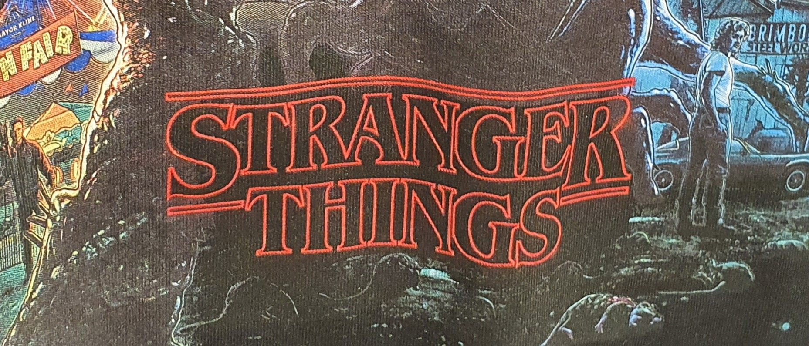

Our favourite wallet-friendly retailer Primark has a new range of *Stranger Things* merchandise out and it’s worth getting excited about! The design is visually stunning with a collage of characters rising above the red neon light of the title that so many of us have come to know and love. But why is the text the most striking part of the design?

Breaking down all the features of this typographic genius may take quite a few paragraphs so I’ll jump right in, starting with the font. The show’s producers chose ITC Benguiat created by Ed Benguiat, which is a serif typeface reminiscent of the art nouveau period. The typeface has a very high x-height, a heavy weight and a high contrast. This combination creates a stressful feeling, it’s quite assertive and gives the sense of impending danger. The font is also sharp, the serifs on the 'T' and 'E' in particular have strong pointed ends... this is definitely not a story about kittens and rainbows.

The hollowed out feature of the text is comparable to the Star Wars text, the original trilogy was realeased from 1970-1982 and the plot revolves around a man thrust into a heroic journey. This choice helps the audience associate the Stranger Things title to being retro and having a similar kind of story, we expect an adventurous plot where ordinary people face an extraordinary event.

The neon red glow of the text is also an effective tool to alert us to the genre. Neon signs were popular in the 1920’s onward and certainly had a revival in the 80’s, but were historically associated with seedy places, or dive bars. Even though the show has nothing to do with these type of places, the feature gives it a darker tone, and along with the dark red colour we expect something dangerous and more sinister.