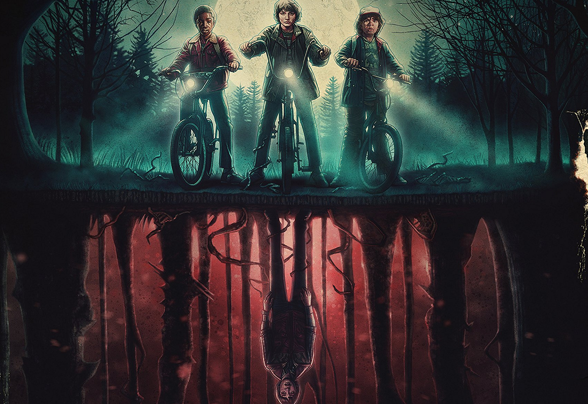

Our favourite wallet-friendly retailer Primark has a new range of *Stranger Things* merchandise out and it’s worth getting excited about! The design is visually stunning with a collage of characters rising above the red neon light of the title that so many of us have come to know and love. But why is the text the most striking part of the design?

Breaking down all the features of this typographic genius may take quite a few paragraphs so I’ll jump right in, starting with the font. The show’s producers chose ITC Benguiat created by Ed Benguiat, which is a serif typeface reminiscent of the art nouveau period. The typeface is condensed, has a very high x-height, a heavy weight and a high contrast. This combination creates a stressful feeling, it’s quite aggressive and gives the sense of impending danger. The text is also sharp, the serifs on the 'T' and 'E' in particular have strong pointed ends which denies the reader any comfort. The font in this logo is already telling us that this is not a love story, there won't likely be any rainbows or kittens in it either - the font is telling us to be afraid (of secret government departments and man-eating demogorgons, perhaps).

The hollowed out feature of the text is comparable to the Star Wars text, the original trilogy was released from 1970-1982 and the plot revolves around a man thrust into a heroic journey. The choice to mimic this feature conjures a sense of nostalgia, and helps the audience associate the Stranger Things title to being retro and having a similar kind of storyline, we expect an adventurous plot where ordinary people face an extraordinary event (the hero's journey).

The neon red glow of the text is also an effective tool to alert us to the genre. Neon signs were popular in the 1920’s onward and certainly had a revival in the 80’s, but were historically associated with seedy places, or dive bars. Even though the show has nothing to do with these types of places, the feature gives it a darker tone, and combined with the dark red colour it stirs an expectation of something dangerous and more sinister.

The typographic voice is rigid and digital, the text has no soft edges, and the 'S' and 'R' of "stranger" are larger than the rest of the letters, despite being all caps. I think this detail emphasises the flipped underline, where the letters sit underneath the line instead of on top of it, a nod to the *Upside Down*, a fictional second dimension which is a prominent theme of the plot.

There is so much that can be unpacked about the plotline of *Stranger Things* simply by analysing the title's typography. The colour, style and font have been used so effectively by the show's producers that the text advertises the series well enough on it's own. It's definitely one of my favourite examples, what do you think of the use of typography in this logo? Leave your opinions in the comments!