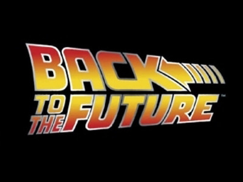
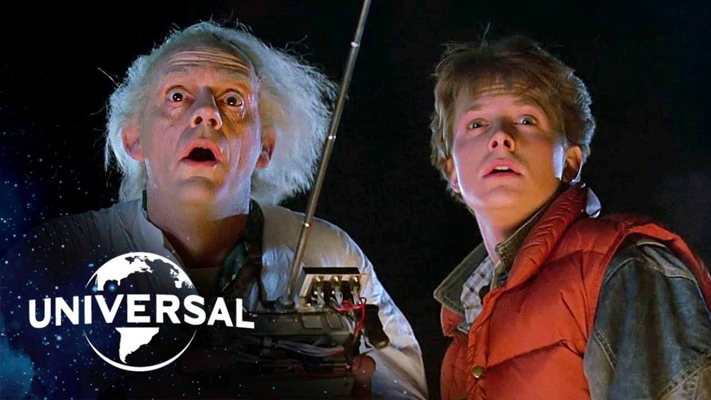

Great Scott! Here’s a blast from the past, Marty McFly and the Delorien in all their 80s glory. But the title text of the film here really steals the show. It’s bold and bright, and seems to be flying off the screen - the slanting of the letters gives the font a dynamic feel, as if it’s about to whoosh right off the page.

The font is in all caps, with a heavy weight and sans-serif - as bold as text can get! The colour choice is bright and a clever combination of yellow which, as its a happy colour, suggests a comical nature, while the red alludes to some blood-pumping action and a romantic element to the plot. There would be no doubt to a viewer that this is a fast-paced action film with bonus features of comedy and romance. And \*spoilers\* we see a car/skateboard chase, a car crash into a barn, Libyans firing machine guns, an awkward infatuation, a new romance forming, and an eccentric professor providing a variety of hilariously quotable lines. So - the typographical choices here definitely work!

Two other interesting features of the typography are:

* The text is all in a justified alignment - although slanted and at a slight diagonal to each other meeting in the middle, all the text fits into a neat block with the word "BACK" being larger than the rest, drawing more attention to the time-travelling to the past plot.
* The arrow icon in the text - a further clue to the plot, and it reinforces that dynamic feel to the title that seems to be pulling the viewer into a backwards direction.