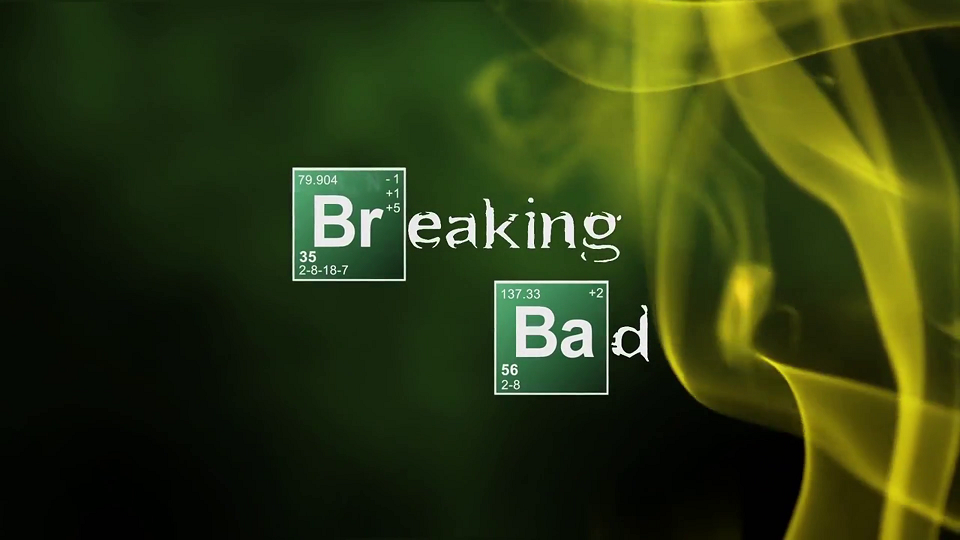

Widely considered to be one of the best TV shows to ever grace our screens, Breaking Bad brought us a desperate meth-slinging chemistry teacher on a downward spiral into a life of crime. Walter White was such a compelling character because unlike your standard on-screen druglord, this guy really knew his chemistry. That is why the incorporation of the chemical symbols in the title of the show works so well! The first two letter of each of the words in the title are stylised into blocks from the periodic table of the elements Bromium and Barium, and the inclusion of all the atomic numbers is a nice touch.

