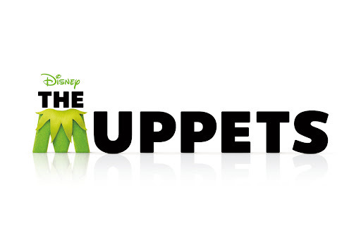
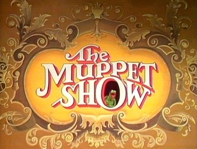

This is a really fun one that caught my eye, The Muppets movie released in 2012 in the UK is still a big favourite among children (and most of their parents) around the world. Created by Jim Henson, this enterprise has been going since 1955 - that's over six decades! The show is full of characters with unique personalities, though none are as loved or recognisable as Kermit the frog, and that's one of the reasons this typography is so unique.

The 'M' in the title is cleverly stylised to look like Kermit with it's fuzzy green appearance and triangular collar. The font matches the rest of the title which is bold, sans-serif and all caps, but the colour green is striking against the solid black and is textured to look like fur. The inclusion of Kermit's recognisable collar also immediately reminds viewers of the the character and evokes nostalgia while also bringing context to the film. Another feature of the text is the faint shadow it casts forward which looks like a reflection on a floor, giving the idea that the letters are standing upright on a stage.

What makes this design choice so interesting is how vastly it differs from the classic "The Muppet Show" typography. It is very simplistic; limited colour palette, very low contrast, no frills, serifs, or embellishments with the exception of the 'M' which too is minimal in design. In contrast, The Muppet Show which aired from 1976 had loads going on.

