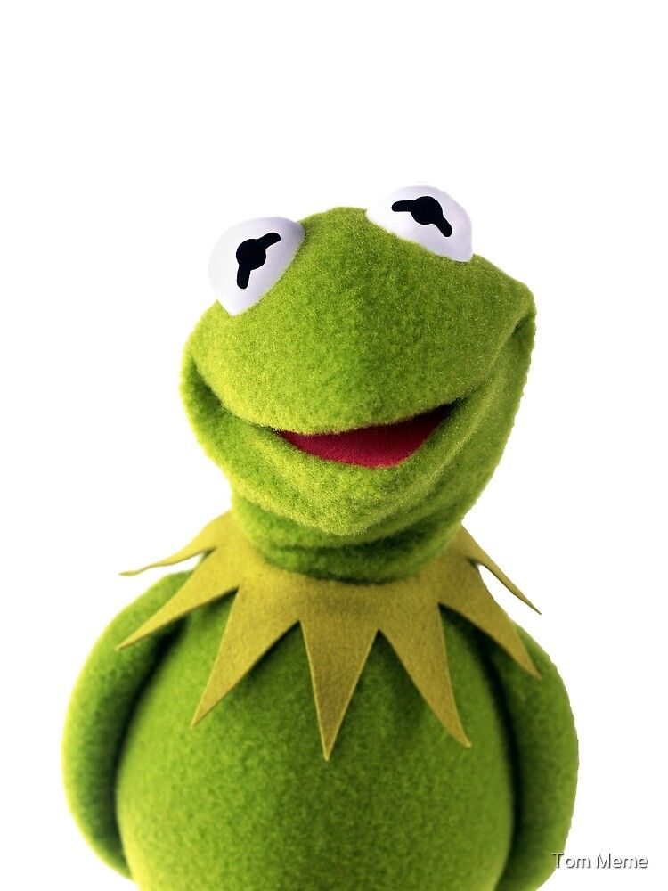

This is a really fun one that caught my eye, The Muppets movie released in 2012 in the UK is still a big favourite among children (and most of their parents) around the world. Created by Jim Henson, this enterprise has been going since 1955 - that's over six decades! The show is full of characters with unique personalities, though none are as loved or recognisable as Kermit the frog, and that's one of the reasons this typography is so unique.

The 'M' in the title is cleverly stylised to look like Kermit with it's fuzzy green appearance and triangular collar. The font matches the rest of the title which is bold, sans-serif and all caps, but the colour green is striking against the solid black and is textured to look like fur. The inclusion of Kermit's recognisable collar also immediately reminds viewers of the the character and evokes nostalgia while also bringing context to the film. Another feature of the text is the faint shadow it casts forward which looks like a reflection on a floor, giving the idea that the letters are standing upright on a stage, which is the reason behind the choice of a crisp, clear white background.

What makes this design choice so interesting is how vastly it differs from the classic "The Muppet Show" typography. It is very simplistic; limited colour palette, very low contrast, no frills, serifs, or embellishments with the exception of the 'M' which too is minimal in design. In contrast, The Muppet Show which aired from 1976 has a lot going on with its typography.

The title is also mostly all caps with the exception of "The", but the letters are embellished with serifs and swirls, differing contrasts and irregular letters. The two P's don't match, even the capital T in "The" is vastly different from the one in "Muppet" and curves around the rest of the word. The sizes of every word are so varied; The M and T are larger than the rest of the letters which appear to be squashed upwards in a curved pattern by the oversized O that is open like a window and showcases Kermit sitting inside it.

The white text is also outlined and has a bright red shadow further complicating the text, and is set on a light to bright yellow gradient circular shape with a gold filigree border. This style was chosen to suit the context of the show which was set in a theatre. The Vaudeville theme and over-the-top stylisation perfectly represents the context of the show and doesn't feel out of place.

Alternatively, The Muppets takes place in 2011, without a theatre or set, and showcases new versions of the old puppets we love. The context of the film suits a more contemporary typography which is why the design is more simplistic. It was also intended for film and therefore has to be more 'punchy' in capturing attention from potential customers, so the text is bold, easy to read, and yet has the Kermit imagery incorporated into the design. The 70s The Muppet Show would have been intended for TV broadcasting and given the time period its viewers would have known the day and time it would be broadcasted so the TV show had more creative leeway.

The typography for this enterprise has certainly evolved, old classic giving away to modern branding. At least one thing has stayed constant; Kermit will always be the star of the show.

