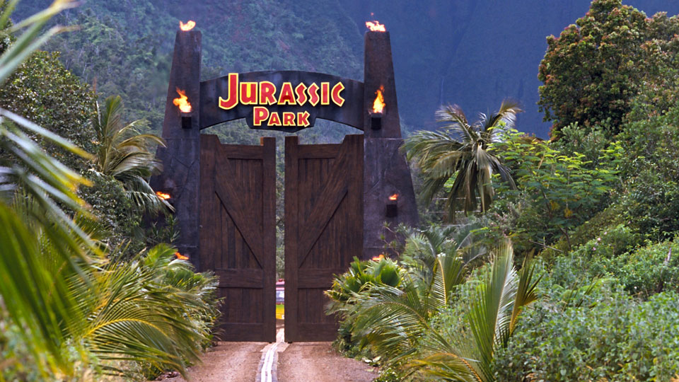
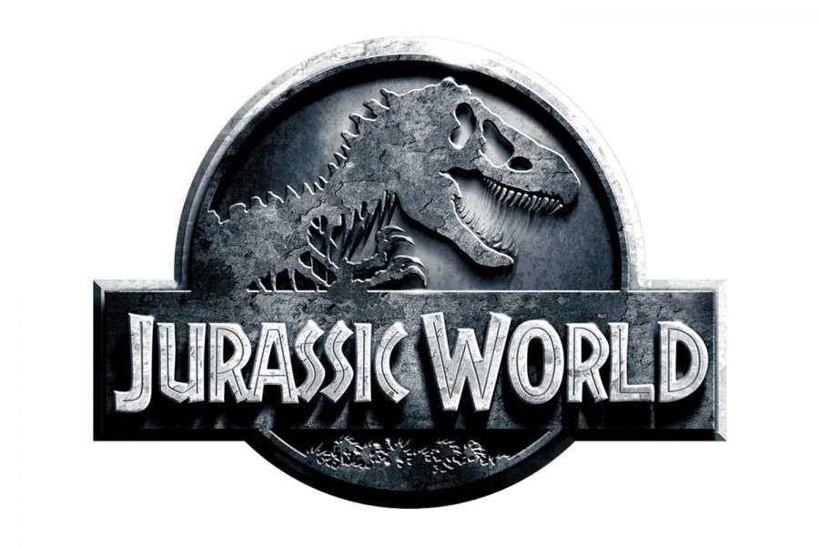

In this 1993 classic, Spielberg introduced us to a world where it was possible to meet our prehistoric predecessors. Jurassic Park brought our childhood dreams of seeing real living dinosaurs to life with its crazy science and then scared us into changing our minds. Now the logo is so iconic that its replicated in pop culture everywhere and is always associated with the film franchise.

The font used is a variation of Neuland font which is a bold, hollowed text that is all caps and sans-serif, originally intended as a modern blackletter font. The changes made to the font when used for Jurassic Park turned it more primitive, with an organic and casual voice. There are several key variations that made that happen; firstly instead of being hollow, the text instead has a thin red line running through a thick bold white stroke, resembling the appearance of bones. The Jurassic Park text is also in small caps, with the 'J' and 'P' sitting on the descender line instead of the baseline making the small letters appear to be floating in the middle. This adds to the organic feel of the text, and also slightly mimicks the structure of the leg bone which is broader at the ends.

The Jurassic Park font is also sans-serif and bold, but there is some contrast in the lettering where the ends of the letters are thicker than the lines in between. This mirrors the descender line versus baseline design with bones having thickness contrast themselves.

The shape of the logo is perfectly circular, with rectangular boxes protruding either side to accomodate the text, set low in the circle to accommodate the image. This design is very reminiscent of the kind of stamp a person might get on their hand after entering a theme park. The design is simplistic and self-contained as a single element, like a stamp or a sticker, which definitely makes it feel like a business logo for something that wants to be branded for entertainment. The round element of the circle perfectly balances out the sharpness of the text giving a mixed feeling of fun and fear.

The colour choices also lend a lot to the interpretation of the logo. The prominent red signifies danger and action while the thin yellow border adds whimsy. The black serves both as a backdrop to make the text and imagery more striking as it does to make the whole ensemble seem more ominous. The imagery of a dinosaur skeleton enforces the extinction aspect of the film, but also gives the audience the feeling that they should stay that way - if a theme park was going to have cute and cuddly dinosaurs they probably would have chosen a cartoon T-rex instead!

The colour, font, and imagery choices definitely enforce a jungle theme, something more primitive and in early stages of development. When comparing the sequel trilogy, its clear how the design elements have altered to reflect the differences in the two worlds.

The basic elements are the same, but the colour is now grey and metallic, the texture of the imagery seems like stamped metal, and the text and dinosaur appear to be protruding from the logo. It resembles a medal, and that implies a legacy that has now been improved upon. This ties in well with the newer installments of the franchise where better technology is used and the scientists themselves have "evolved" into ones who know more about what they're doing. There's an entirely differrent emotion provoked by this design even though the structure, font and imagery is the same. Both logos suit their trilogys, and while they are so similar, there are so many differences that set them apart. The only thing I can't decide is: Which theme park would I rather go to? Perhaps neither until they work out the kinks.