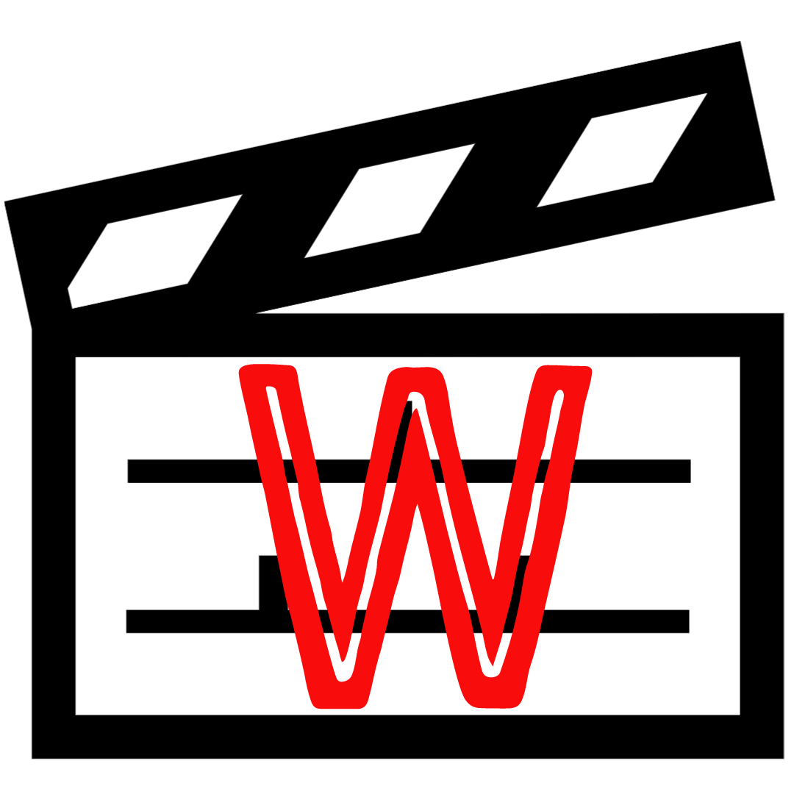
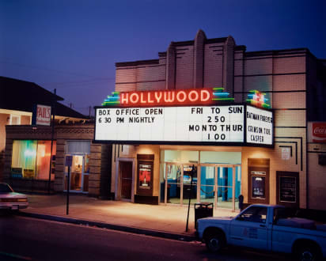
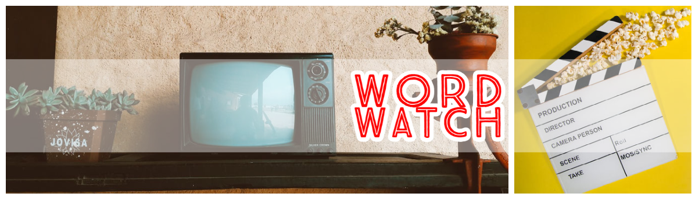

I'm an avid Film and TV watcher and have become fascinated with examining the techniques networks use to appeal to and draw in viewers. Posters and promotional material are all designed to subtly feed us so much information about the story to pique our interest before we even tune in. 

Artwork, lighting, wardrobe; all of these features are expertly manipulated to influence emotion, tell the story, and stir empathy for the character. Less obvious than these, but one of the most effective and simplest tools, is the use of typography.

In this blog I aim to explore the application of various typographical characteristics and how effective they are in influencing viewers. I'll be taking a deeper look into why we subconsciously respond to the appearance of words more than what they're saying, and why networks subsequently make their typographical choices.

Word watch is a play on the phrase "bird watch", and as my television *watching* habits inspired the concept for this blog, I thought it appropriate! My logo design is inspired by old school cinema arthouses, the light-box readographs that would wrap around the front of the buildings were white with black horizontal lines and black text that would announce the featured films. The word "Cinema" or the name of the theatre was typically displayed in hollow, glowing, red letters. I chose the clapboard icon to further stylise this logo as one to do with film and television, and the text box mimics the cinema lightboxes effectively.

For my banner I wanted a classic feel with a modern twist, so I combined a picture of a retro television set and a clapboard set against a bright yellow background to enforce a positive vibe. The text I chose is sans-serif, all caps and hollow, comparable to the aforementioned neon cinema signs. I also liked the combination of the colour palette, which reminds me of 1930s film posters; reds, yellows, greens and beiges.

My aims for this blog are to showcase the thought processes behind typographical design and challenge myself to become a better analyst of text. Thanks for stopping by, I hope you will find this blog a thoughtful and well-rounded exploration of film and tv typography!