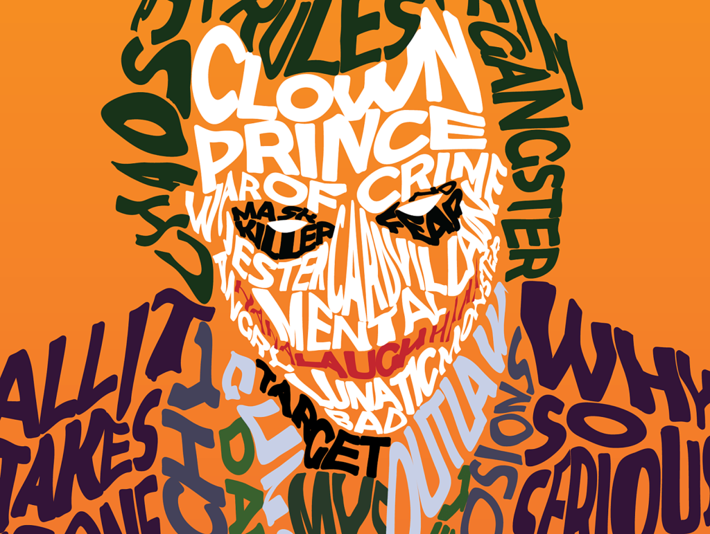
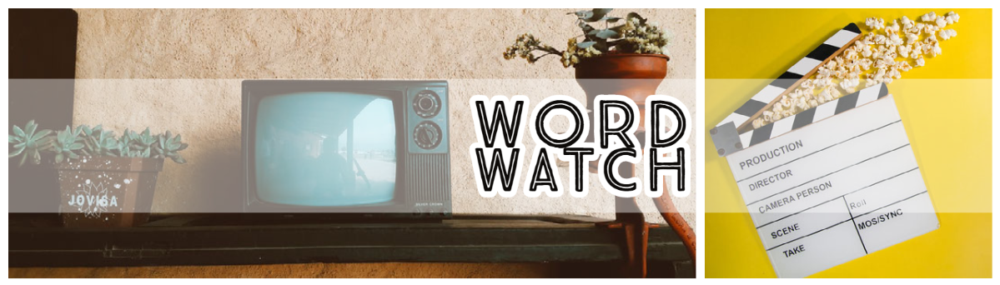
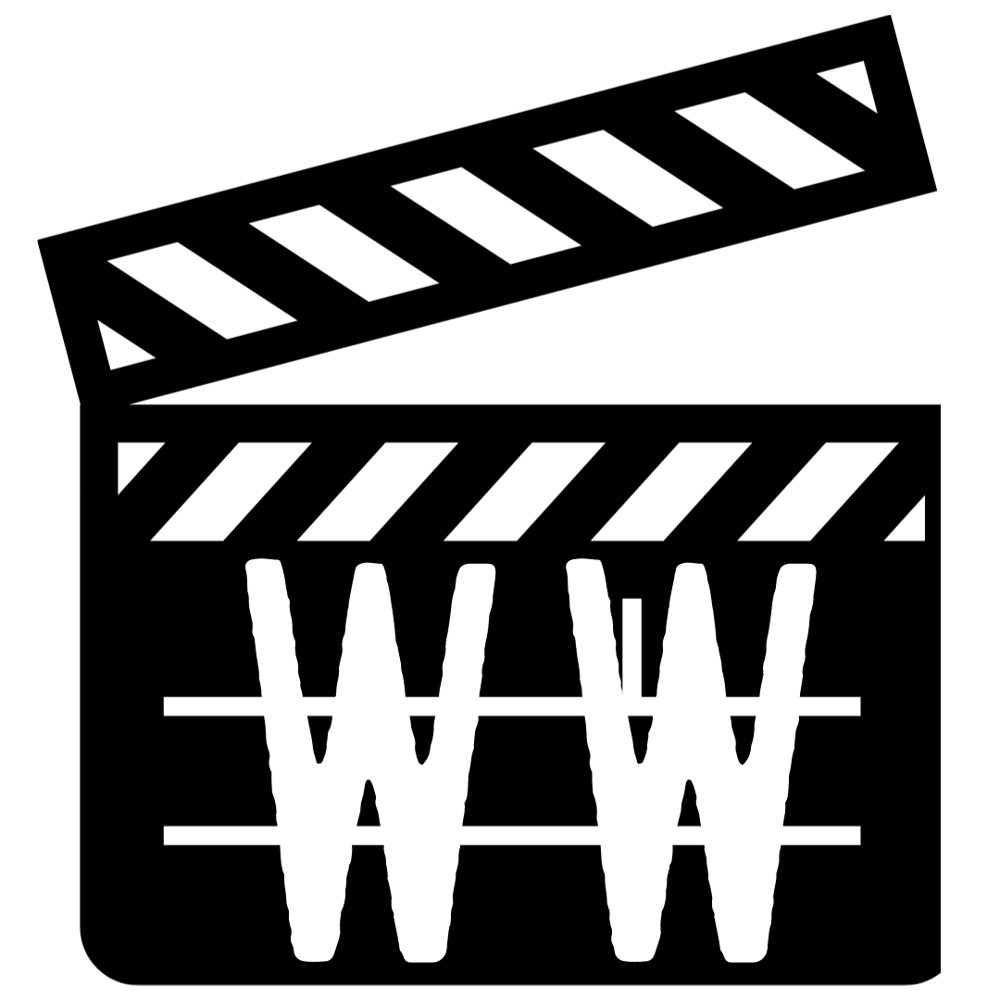

I'm an avid Film and TV watcher and have become fascinated with examining the techniques networks use to appeal to and draw in viewers. Posters and promotional material are all designed to subtly feed us so much information about the story to pique our interest before we even tune in. 

Artwork, lighting, wardrobe; all of these features are expertly manipulated to influence emotion, tell the story, and stir empathy for the character. Less obvious than these, but one of the most effective and simplest tools, is the use of typography.

In this blog I aim to explore the application of various typographical characteristics and how effective they are in influencing viewers. I'll be taking a deeper look into why we subconsciously respond to the appearance of words more than what they're saying, and why networks subsequently make their typographical choices.

Word watch is a play on the phrase "bird watch", and as my television *watching* habits inspired the concept for this blog, I thought it appropriate! My banner design includes a picture of a retro TV setup, the font is reminiscent as a game show title, and I've stylised the "o" as the lens of a camera to fit the theme.

